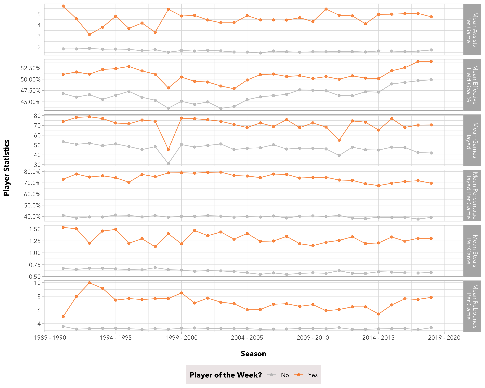
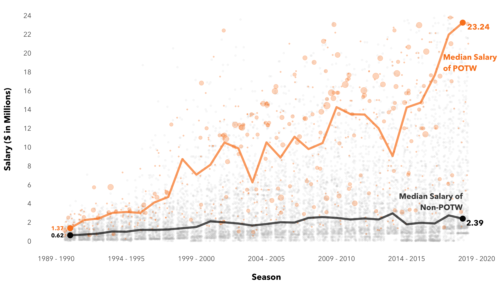

## USF MSDS 593: EDA and Visualizations
Project: NBA Player of the Week

###### Team Members
* Shirley Li ([@Shirleyiscool](https://github.com/Shirleyiscool))
* Charles Siu ([@chunheisiu](https://github.com/chunheisiu))

### Introduction
#### 3-Minute Story
There exists a common belief that one's performance and experience dictate one's compensation. In this project, we aim to tackle this belief by examining a number of datasets related to NBA Players, in particular, **Player Statistics**, **Player Salary**, **Player of the Week**, and **Most Valuable Player of the Year (MVP)**. Based on these datasets, we want to know if a better NBA player, based on a range of game statistics, is more likely to be named the Player of the Week or to receive the MVP award, compared to those who underperform. Meanwhile, we also want to know if Players of the Week or MVP's would receive a higher salary compared to those who do not receive any awards or honors. Based on these findings, we could measure the influence of awards and performances on an NBA player's salary.

On the other hand, we all say basketball is a team game but does that reflect reality in the world of the NBA? To answer that, we seek the relationship between the best players and the best team. If a team is made up of the best players, how likely is it for the team to win the championship? Can a team with no “dream" players still be the champion? Based on these findings, we could determine if and how the performance of a team with one best player compared to a team with a few better players.

#### Big Idea
NBA is not a place we can always observe the magic power of teamwork, but a place we can usually witness the talented, whose compensation also reflects their true value, lead the game.

### Data Source
#### Main Data
- NBA Player of the Week (1985 - 2019) 
https://www.kaggle.com/jacobbaruch/nba-player-of-the-week

- NBA Player Salary from basketball-reference.com (1990 - 2017) 
https://www.kaggle.com/whitefero/nba-player-salary-19902017 
https://data.world/datadavis/nba-salaries/workspace/file?filename=nba_salaries_1990_to_2018.csv

- NBA Player Salary from basketball-reference.com (2018 - 2019) 
https://web.archive.org/web/20181002194236/www.basketball-reference.com/contracts/players.html

- NBA Yearly Summary (1985 - 2019)
https://www.basketball-reference.com/leagues/

#### Supplemental Data
- NBA Teams Abbreviations 
https://en.wikipedia.org/wiki/Wikipedia:WikiProject_National_Basketball_Association/National_Basketball_Association_team_abbreviations

- NBA Team Locations 
https://en.wikipedia.org/wiki/National_Basketball_Association

- NBA Team Colors 
https://teamcolorcodes.com/nba-team-color-codes/

### Visualizations
- Visualization 1: Relationship between NBA Player of the Week and Player Statistics  

- Visualization 2: Relationship between NBA Player of the Week and Player Salary  

- Visualization 3: Relationship between NBA Player of the Week and Champion Team  

- Visualization 4: Relationship between NBA Player of the Week and Other Awards/Honors  

- Visualization 5: Relationship between NBA Player of the Week and Team Location  

